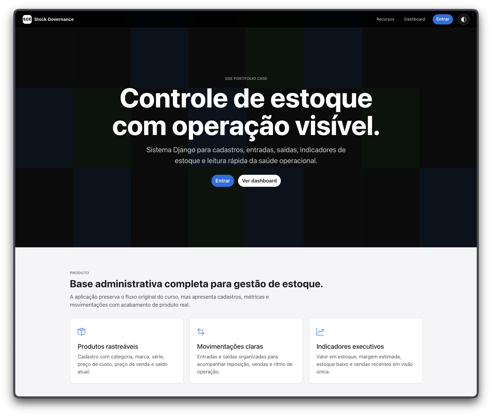
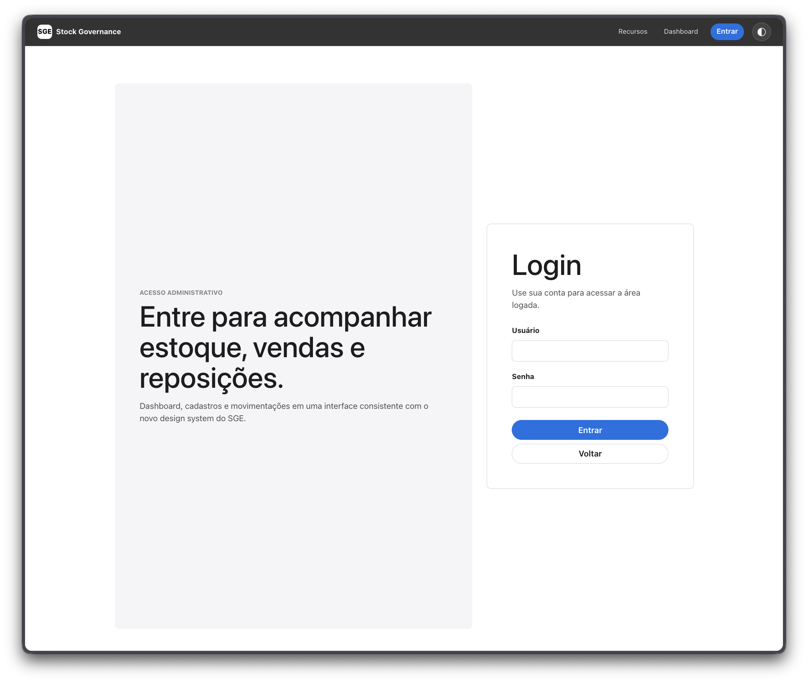
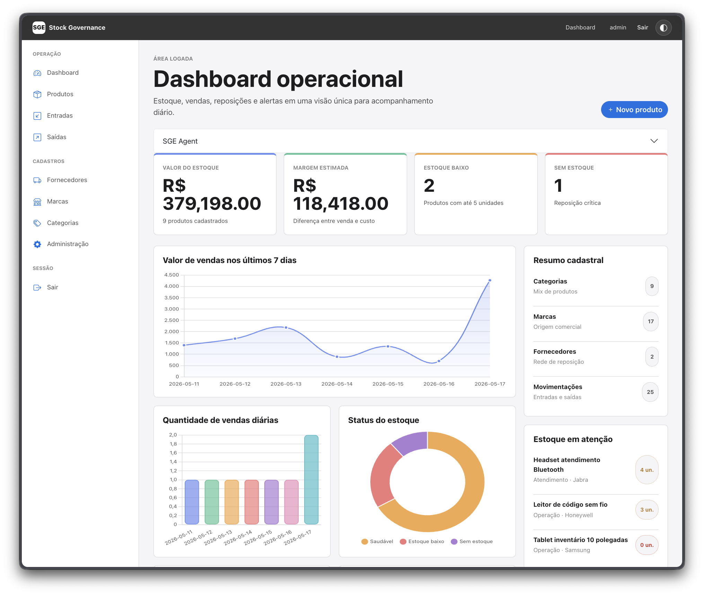
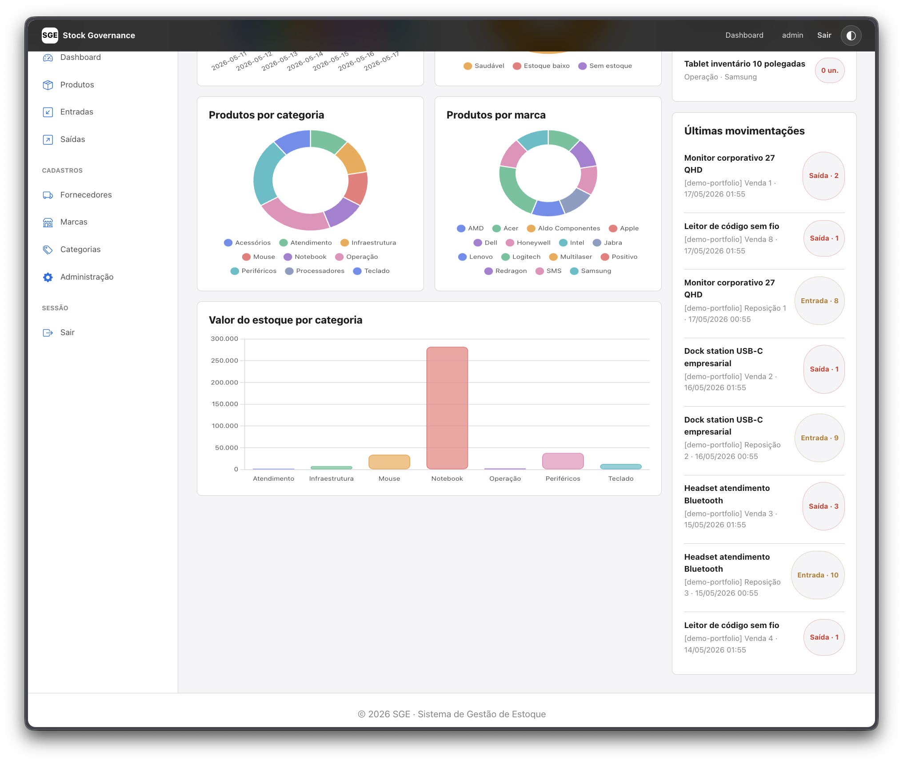
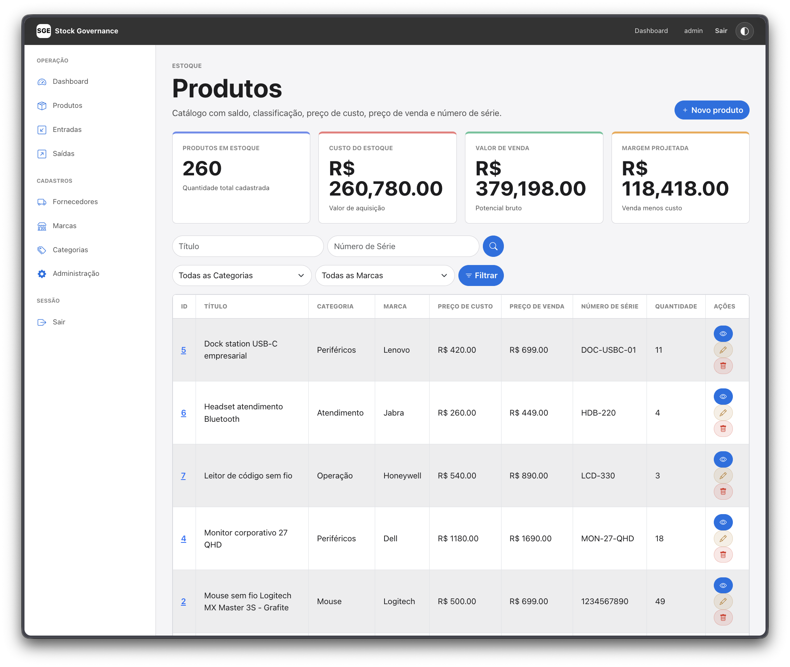
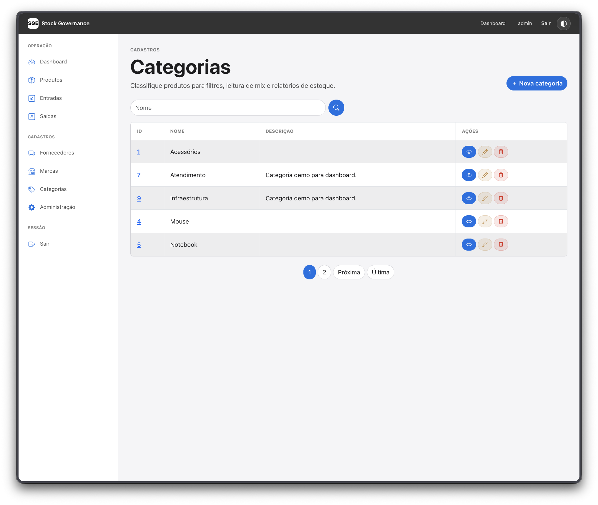
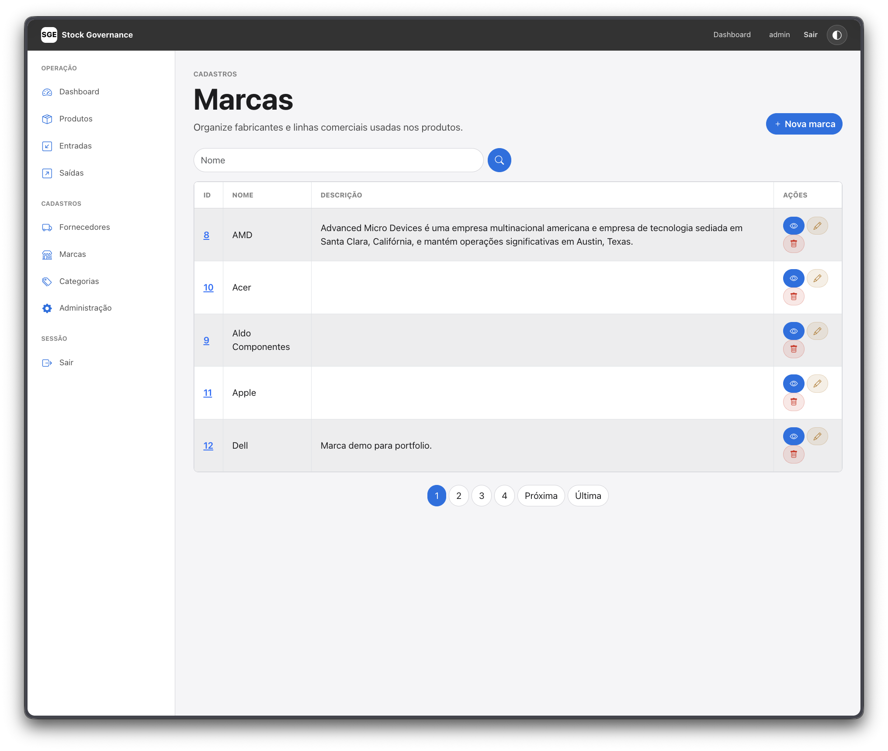
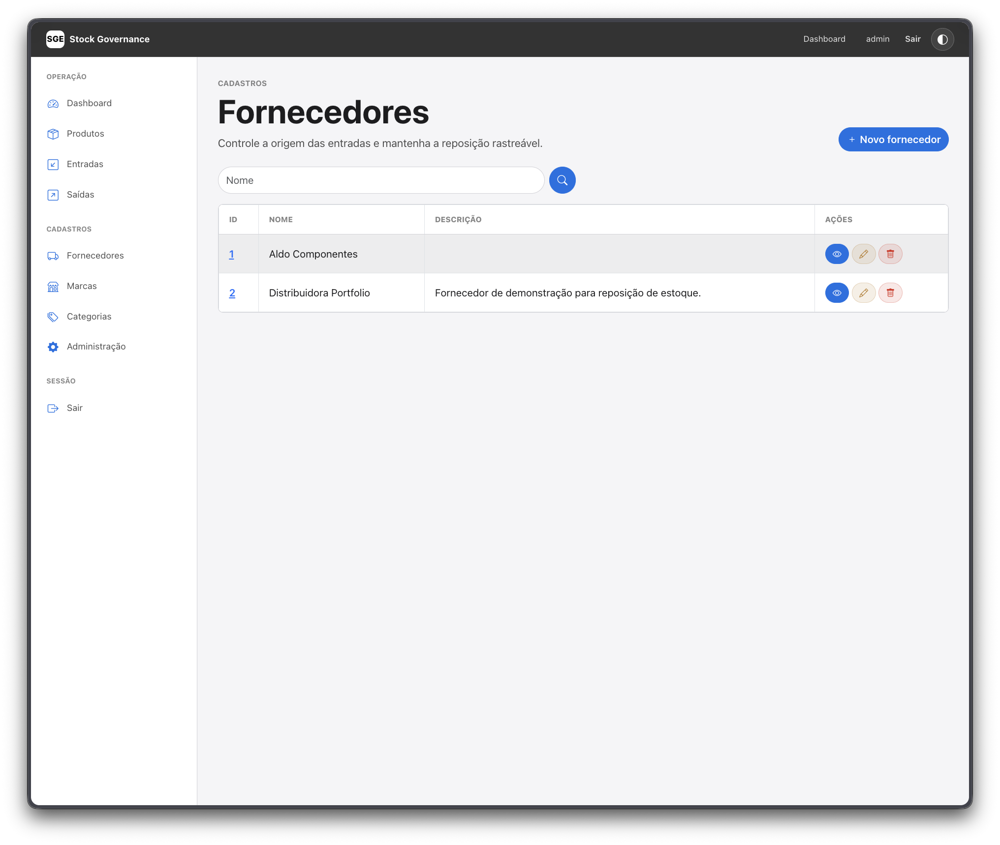
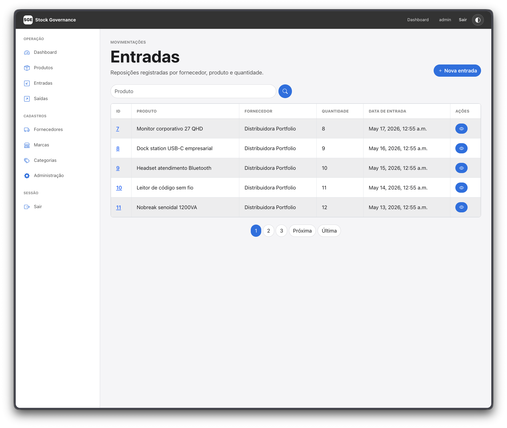
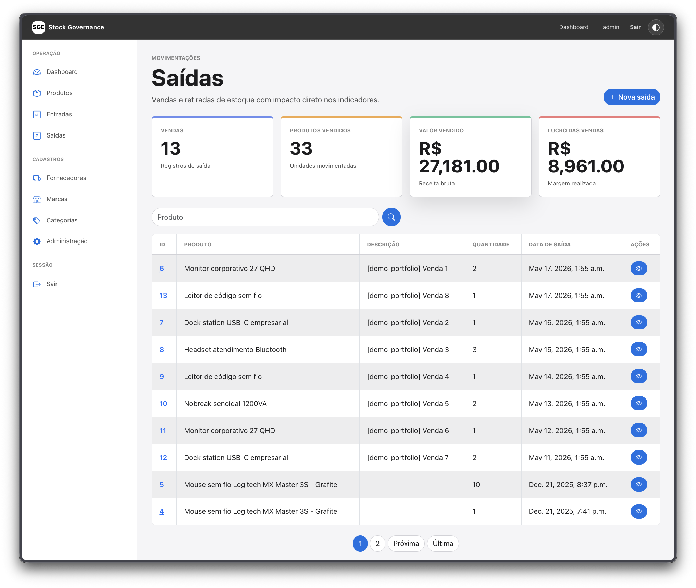

# SGE - Sistema de Gestão de Estoque

Sistema de gestão de estoque construído com Django 6.0, voltado para controle operacional de produtos, categorias, marcas, fornecedores e movimentações de entrada e saída.

## Telas do Sistema

### Landing Page


### Login


### Dashboard




### Produtos


### Categorias


### Marcas


### Fornecedores


### Entradas


### Saídas


## Funcionalidades

- **Dashboard operacional** com métricas de estoque, vendas e alertas
- **Gestão de produtos** com controle de quantidade, preço de custo e venda
- **Categorias e marcas** para organização do catálogo
- **Fornecedores** com cadastro e vínculo com produtos
- **Entradas e saídas** com rastreabilidade de movimentações
- **Autenticação** com login e JWT
- **Tema claro/escuro** com design system inspirado na Apple

## Tech Stack

| Camada | Tecnologia |
|--------|-----------|
| Backend | Django 6.0 |
| API | Django REST Framework + SimpleJWT |
| Banco de dados | SQLite |
| Frontend | Templates Django + Chart.js |
| Estilo | CSS custom properties (Design System próprio) |
| Linting | Flake8 |

## Início Rápido

```bash
# Clone o repositório
git clone <url-do-repositorio>
cd SGE

# Crie o ambiente virtual
python -m venv .venv
source .venv/bin/activate

# Instale as dependências
uv sync  # ou: pip install -r requirements.txt

# Execute as migrações
python manage.py migrate

# Inicie o servidor
python manage.py runserver
```

Acesse em `http://127.0.0.1:8000/`

## Documentação

| Documento | Descrição |
|-----------|-----------|
| [Configuração do Ambiente](docs/configuracao-ambiente.md) | Requisitos, instalação e setup do projeto |
| [Estrutura do Projeto](docs/estrutura-projeto.md) | Organização de pastas e módulos |
| [Convenções de Commit](docs/convencoes-commit.md) | Padrões de mensagens de commit |
| [Guia de Estilo](docs/guia-estilo.md) | Padrões de codificação e nomenclatura |